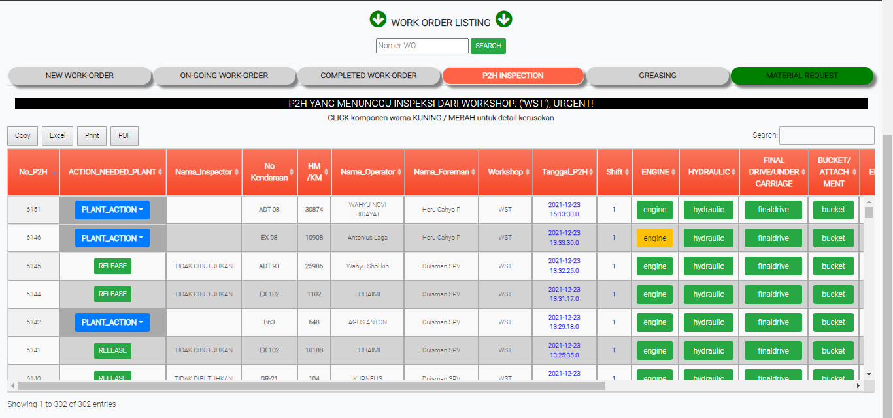
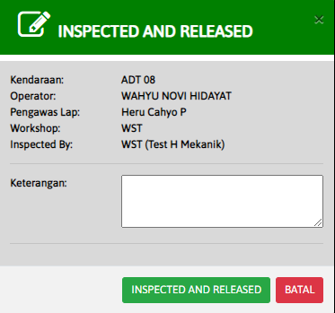
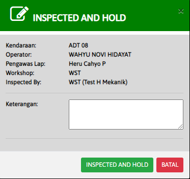

# P2H INSPECTION

### P2H INSPECTION

Tabel ini menginformasikan hasil dari pemeriksaan P2H untuk setiap kendaraan. Jika hasil P2H berwarna kuning atau merah, kendaraan tidak boleh dioprasikan. Klik PLANT\_ACTION yang berisi HOLD dan RELEASE untuk menginformasikan hasil P2H.

### RELEASE

Form ini digunakan untuk memperbolehkan pengoperasian kendaraan. Dibolehkan karna kendaraan sudah aman ketika diperiksa P2H

### HOLD

Form ini digunakan untuk tidak memperbolehkan pengoperasian. Kendaraan tidak dibolehkan karna kendaraan memiliki masalah ketika diperiksa P2H
